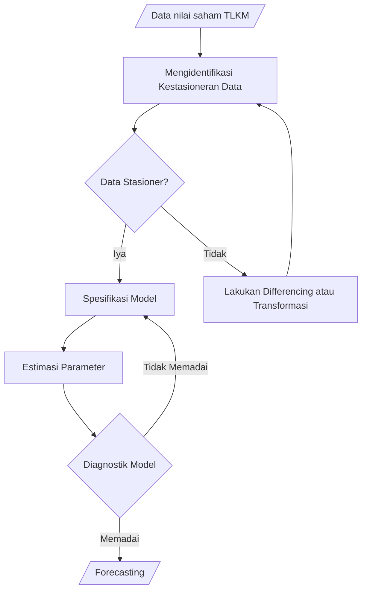

# Time Series Analysis
Time Series Analysis: Stock Forecasting PT. Telkom Indonesia (Persero) Tbk [TLKM] On October, 2004 – June 16, 2023, Using ARIMA Time Series Analysis (p,d,q)

> **Disclaimer :**
> This project is for educational purposes.
> 
> **Tujuan :**
> 1. Mengetahui proses dalam menganalisis data runtun waktu sampai mendapatkan model yang sesuai pada data tersebut.
> 2. Mendapatkan model runtun waktu yang terbaik dalam efisiensi parameter maupun kemampuan prediktif dalam memprediksi harga penutupan saham TLKM per bulan berdasarkan data dari bulan Oktober 2004 sampai Juni 2023 (tanggal 16).
> 3. Mendapatkan hasil prediksi harga penutupan saham TLKM dalam beberapa bulan ke depan (4 bulan setelah Juni 2023).
>
> **Credits :**
> 1. Rifqi Hafizuddin
> 2. Aurelio Naufal Effendy
> 3. Kamal Muftie Yafi

## 1. Data ##
Sampel yang digunakan dalam penelitian ini adalah [data harga penutupan saham Perusahaan Perseroan PT Telekomunikasi Indonesia Tbk (TLKM)](https://finance.yahoo.com/quote/TLKM.JK/history?period1=1096329600&period2=1686960000&interval=1mo&filter=history&frequency=1mo&includeAdjustedClose=true) bulanan selama 226 bulan, sejak 1 Oktober 2004 hingga Juni 2023 (tanggal 16).
<p align="center">
  
  <br>
  <i>Gambar 1 Plot Data Harga Penutupan Nilai Saham TLKM</i>
</p>

Berikut ringkasan dari data yang digunakan:
```
      Waktu           Harga.Penutupan   
 Min.   :2004-10-01   Min.   : 855
 1st Qu.:2009-06-08   1st Qu.:1602
 Median :2014-02-15   Median :2345
 Mean   :2014-02-14   Mean   :2636
 3rd Qu.:2018-10-24   3rd Qu.:3772 
 Max.   :2023-06-16   Max.   :4690
```

## 2. Tahapan Penelitian ##


## 3. Uji Stasioner ##
Berdasarkan **Gambar 1** dapat dilihat bahwa secara subjektif data harga penutupan nilai saham TLKM yang dimiliki belum bersifat stasioner karena dapat dilihat masih terdapat kecenderungan naik.
```
	Augmented Dickey-Fuller Test

data:  ts
Dickey-Fuller = -2.5957, Lag order = 6, p-value = 0.3258
alternative hypothesis: stationary
```

Berdasarkan Uji Augmented Dickey-Fuller, didapatkan $p − value = 0.3258 > 0.05$. Keputusan yang diambil adalah tidak menolak $H_0$ dan disimpulkan bahwa data observasi bersifat tidak stasioner, sehingga perlu dilakukan transformasi pada data dengan melakukan differencing terhadap data.
<p align="center">
  
  <br>
  <i>Gambar 2 Plot Data Harga Penutupan Nilai Saham TLKM Setelah Differencing (d = 1)</i>
</p>

```
	Augmented Dickey-Fuller Test

data:  diff_ts
Dickey-Fuller = -5.0943, Lag order = 6, p-value = 0.01
alternative hypothesis: stationary

Warning message:
In adf.test(diff_ts) : p-value smaller than printed p-value
```

Berdasarkan **Gambar 2** secara subjektif data sudah terlihat stasioner. Berdasarkan Uji Augmented Dickey-Fuller didapatkan $p − value = 0.01 < 0.05$. Keputusan yang diambil adalah menolak $H_0$ dan disimpulkan bahwa data observasi hasil differencing bersifat stasioner.

## 4. Spesifikasi Model ##
Pemilihan model akan dilakukan berdasarkan grafik ACF, PACF, dan EACF dari data hasil differencing.
### 4.1. ACF dan PACF ###
<p align="center">
  
  <br>
  <i>Gambar 3 Plot ACF dan PACF Data Harga Penutupan TLKM Setelah Differencing (d = 1))</i>
</p>

Berdasarkan **Gambar 3**, , pada plot ACF terlihat bahwa terdapat beberapa tiang pancang. Sementara itu, pada plot PACF juga terdapat beberapa tiang pancang. Pola yang didapat dari ACF dan PACF tidak menggambarkan pola AR atau MA. Maka, model runtun waktu yang diduga adalah ARIMA yang ordenya akan dicari melalui tabel EACF.

### 4.2. EACF ###
```
AR/MA
  0 1 2 3 4 5 6 7 8 9 10 11 12 13
0 o x o o o o o o o o o  o  o  o 
1 x x o o o o o o o o o  o  o  o 
2 x x o o o o o o o o o  o  o  o 
3 x x x o o o o o o o o  o  o  o 
4 x x x o o o o o o o o  o  o  o 
5 x o x o x o o o o o o  o  o  o 
6 x x o o x o o o o o o  o  o  o 
7 x x x o o o o o o o o  o  o  o
```

Berdasarkan tabel EACF. terdapat tiga model yang akan menjadi kandidat, yaitu $ARIMA(0,1,0)$, $ARIMA(1,1,1)$, dan $ARIMA(0,1,2)$. Dari ketiga model tersebut akan diseleksi untuk memperoleh model terbaik.

## 5. Pemilihan Model Terbaik ##
Pemilihan model terbaik akan didasari atas nilai Log-Likelihood terbesar, nilai Akaike Information Criterion (AIC) terkecil dan Bayesian Information Criterion (BIC) terkecil. Metode pemilihan dilakukan dengan cara pertama membuat semua model ARIMA yang menjadi kandidat model terbaik, kemudian membandingkan nilai Log- Likelihood, AIC, dan BIC.
```
          model1     model2      model3     
coef      numeric,0  numeric,3   numeric,3  
sigma2    0.04063222 0.04057505  0.04007547 
var.coef  numeric,0  numeric,9   numeric,9  
mask      logical,0  logical,3   logical,3  
loglik    40.91707   42.58153    43.95846   
aic       -79.83414  -77.16306   -79.91692  
arma      integer,7  integer,7   integer,7  
residuals ts,225     ts,225      ts,225     
call      expression expression  expression 
series    "tf_ts"    "tf_ts"     "tf_ts"    
code      0          0           0          
n.cond    0          0           0          
nobs      224        224         224        
model     list,10    list,10     list,10    
aicc      -79.81612  -76.98042   -79.73427  
bic       -76.4225   -63.51648   -66.27033  
xreg      ts,225     integer,225 integer,225
x         ts,225     ts,225      ts,225     
fitted    numeric,0  ts,225      ts,225
```

Didapatkan model 1 merupakan model yang memiliki nilai AIC terkecil, BIC terkecil, dan Log-Likelihood terkecil. Maka, model $ARIMA(0,1,0)$ adalah model terbaik yang akan digunakan.

## 5. Estimasi Parameter ##
Metode estimasi parameter yang digunakan untuk data harga penutupan saham TLKM adalah penggunaan conditional sum of square untuk menentukan nilai awal kemudian diestimasi dengan memanfaatkan metode maximum-likelihood (CSS-ML).
```
Series: tf_ts 
ARIMA(0,1,0) 

sigma^2 = 0.04063:  log likelihood = 40.92
AIC=-79.83   AICc=-79.82   BIC=-76.42
```

Diperoleh estimasi yang dapat diekspresikan sebagai berikut:
$$\sigma_\epsilon^2 = 0.04063$$

$$\nabla Y_t = e_t$$

## 6. Model Diagnostik ##
### 6.1. Analisis Residual ###
#### 6.1.1. Uji Independensi/Autokorelasi Residual ####

<p align="center">
  
  <br>
  <i>Gambar 4 Plot Runtun Waktu Residual Model $ARIMA(0,1,0)$ Harga Penutupan Saham TLKM</i>
</p>
Secara subjektif dari Gambar 4, dapat dilihat bahwa plot yang dihasilkan stasioner karena tidak terlihat kecenderungan rata-rata yang meningkat atau menurun seiring waktu. Selain itu, juga tidak terlihat adanya bentuk deterministik dari plot residual yang terbentuk. Hasil ini juga didukung dari bentuk plot ACF yang diperoleh seperti yang terlihat pada Gambar 5.

<p align="center">
  
  <br>
  <i>Gambar 5 Plot ACF Residual Model $ARIMA(0,1,0)$ Harga Penutupan Saham TLKM</i>
</p>

Berdasarkan Gambar 5, autokorelasi lag-$k$ dikatakan tidak berbeda signifikan dari 0 apabila tidak melewati garis putus-putus. Dapat dilihat bahwa seluruh nilai autokorelasi hingga lag-$36$ tidak melewati garis putus-putus tersebut. Sehingga dari hasil ini dapat dikatakan bahwa autokorelasi dari residual model $ARIMA(0,1,0)$ untuk data harga penutupan saham tidak berbeda signifikan dari 0 dan memenuhi salah satu syarat kestasioneran data runtun waktu

```
	Ljung-Box test

data:  Residuals from ARIMA(0,1,0)
Q* = 27.77, df = 24, p-value = 0.2698

Model df: 0.   Total lags used: 24
```
Berdasarkan Uji Ljung-Box, dapat dilihat bahwa $p − value = 0.2698 > 0.05$. Diambil keputusan untuk tidak menolak $H_0$, sehingga disimpulkan data residual $\forall \rho_k = 0$ (residual saling independen, dikarenakan nilai autokorelasinya yang tidak berbeda signifikan dengan 0).

```
	Augmented Dickey-Fuller Test

data:  fit$residuals
Dickey-Fuller = -5.0838, Lag order = 6, p-value = 0.01
alternative hypothesis: stationary

Warning message:
In adf.test(fit$residuals) : p-value smaller than printed p-value
```
Berdasarkan Uji Augmented Dickey-Fuller, dapat dilihat bahwa $p − value = 0.01 < 0.05$. Diambil keputusan untuk menolak $H_0$, sehingga disimpulkan data residual stasioner. Dari analisis ini dapat disimpulkan bahwa residual model runtun waktu $ARIMA(0,1,0)$ untuk data Harga Penutupan Saham TLKM stasioner dan independen.

#### 6.1.2. Uji Kenormalan Residual ####
<p align="center">
  
  <br>
  <i>Gambar 6 Histogram Frekuensi Residual Data Harga Penutupan Saham TLKM</i>
</p>
Berdasarkan plot yang diperoleh pada Gambar 6, dapat dilihat bahwa residual model menyerupai distribusi Normal. Kemudian, secara subjektif dapat dilihat dari Gambar 7 bahwa Q-Q plot dari residual model menunjukkan persebaran data tidak sepenuhnya mengikuti garis diagonal, dimana garis diagonal tersebut merepresentasikan data yang berdistribusi Normal. Dengan kata lain, secara subjektif melalui Q-Q plot dapat disimpulkan residual model tidak berdistribusi Normal.

<p align="center">
  
  <br>
  <i>Gambar 7 Plot Residual Data Harga Penutupan Saham TLKM</i>
</p>

Terdapat perbedaan hasil interpretasi antara histogram dan Q-Q plot, sehingga perlu dilakukan uji statistik untuk normalitas data. Akan digunakan uji Jarque-Bera (JB Test) untuk memastikan kenormalan residual model. Diperoleh hasil pengujian sebagai berikut.

```
	Jarque Bera Test

data:  fit$residuals
X-squared = 4.222, df = 2, p-value = 0.1211
```
Dengan menggunakan taraf signifikansi sebesar $5%$, dapat dilihat bahwa $p − value = 0.1211 > 0.05$ maka $H_0$ gagal ditolak dan dapat disimpulkan dari aturan keputusan bahwa data residual berdistribusi Normal.

### 6.2. Overfitting ###
Pada kasus ini, overfitting akan dilakukan dengan mengajukan model $ARIMA (0,1,1)$ dan $ARIMA (1,1,0)$. Model $ARIMA (0,1,0)$ didefinisikan sebagai fit, model $ARIMA (0,1,1)$ didefinisikan sebagai overfit1, dan model $ARIMA (1,1,0)$ didefinisikan sebagai overfit2. Akan dibandingkan ketiga model sebagai berikut.

```
          fit        overfit1    overfit2   
coef      numeric,0  -0.03681815 -0.02733988
sigma2    0.04063222 0.04077336  0.0407841  
var.coef  numeric,0  0.005986149 0.00450805 
mask      logical,0  TRUE        TRUE       
loglik    40.91707   41.02914    40.99994   
aic       -79.83414  -78.05828   -77.99989  
arma      integer,7  integer,7   integer,7  
residuals ts,225     ts,225      ts,225     
call      expression expression  expression 
series    "tf_ts"    "tf_ts"     "tf_ts"    
code      0          0           0          
n.cond    0          0           0          
nobs      224        224         224        
model     list,10    list,10     list,10    
aicc      -79.81612  -78.00399   -77.94559  
bic       -76.4225   -71.23499   -71.1766   
x         ts,225     ts,225      ts,225     
fitted    ts,225     ts,225      ts,225 
```
Kriteria overfiting akan digunakan dengan membandingkan nilai log-likelihood, AIC, dan BIC. Berdasarkan hasil di atas, dapat dilihat bahwa model $ARIMA(0,1,0)$ memiliki nilai AIC dan BIC yang paling kecil jika dibandingkan dengan model overfiting. Sementara itu, nilai log-likelihood yang didapat dari model $ARIMA(0,1,0)$ merupakan yang paling kecil, namun nilainya tidak berbeda terlalu signifikan dengan model overfit.

Sehingga dapat disimpulkan model fit $ARIMA(0,1,0)$ merupakan model terbaik yang akan digunakan untuk memprediksi Saham TLKM. Untuk memperkuat pernyataan ini, dapat dilakukan uji koefisien antara model fit dan overfit. Namun, kami tidak dapat dilakukan uji koefisien karena model random walk tidak memuat koefisien.

## 7. Peramalan (Forecasting) ##
### 7.1. Ex Post ###
Akan dilihat akurasi forecast dengan metode cross validation. Metode cross validation membagi data menjadi dua, yaitu data train dan data test. Data train (Oktober 2004 – Februari 2023) adalah data yang digunakan umtuk membentuk model, sedangkan data test (Maret 2023 – Juni 2023) adalah data yang digunakan sebagai pembanding dengan hasil forecast yang dimiliki.

```
         test forecast_train.Point Forecast forecast_train.Lo 80 forecast_train.Hi 80
Mar 2023 4060                          3880             3657.050             4102.950
Apr 2023 4250                          3880             3564.701             4195.299
May 2023 4040                          3880             3493.839             4266.161
Jun 2023 3970                          3880             3434.099             4325.901
         forecast_train.Lo 95 forecast_train.Hi 95
Mar 2023             3539.027             4220.973
Apr 2023             3397.791             4362.209
May 2023             3289.417             4470.583
Jun 2023             3198.054             4561.946
```

<p align="center">
  
  <br>
  <i>Gambar 8 Plot Nilai Aktual dan Nilai Forecast Harga Penutupan Saham TLKM</i>
</p>

Berdasarkan hasil <i>forecasting</i> yang didapatkan, terlihat bahwa seluruh nilai aktual berada pada interval kepercayaan 95%. Hal ini dapat disimpulkan bahwa model yang diajukan dapat memprediksi data Harga Penutupan Saham TLKM cukup baik.

| i | Absolute Error | Relative Error (%) |
|:---:|:---:|:---:|
| 223 | 180 | 4.433498 |
| 224 | 370 | 8.705882 |
| 225 | 160 | 3.960396 |
| 226 | 90 | 2.267003 |

Berdasarkan tabel di atas, didapatkan Mean Absolute Error $=200$.

### 7.1. Ex Ante ###
Selanjutnya dilakukan peramalan untuk meramal harga penutupan saham TLKM untuk 4 bulan ke depan yaitu bulan Juli 2023 – Oktober 2023. Berikut ini adalah hasil <i>forecasting</i>.

```
         Point Forecast    Lo 80    Hi 80    Lo 95    Hi 95
Jul 2023           3970 3660.201 4302.079 3504.789 4487.340
Aug 2023           3970 3538.104 4446.467 3326.296 4718.018
Sep 2023           3970 3446.806 4560.066 3194.686 4901.867
Oct 2023           3970 3371.418 4657.764 3087.237 5061.612
```

<p align="center">
  
  <br>
  <i>Gambar 9 Plot Hasil Forecast Harga Penutupan Saham TLKM</i>
</p>

## Kesimpulan ##
1. Gambaran umum pada data harga penutupan saham PT. Telkom Indonesia (Persero) Tbk [TLKM] pada periode bulan Oktober 2004 sampai Juni 2023 (tanggal 16) yakni harga penutupan tertingginya yaitu Rp4.690,00 pada bulan Juli dan Agustus tahun 2017, sedangkan harga penutupan terendahnya yaitu Rp855,00 pada bulan April 2005, dengan nilai rata-ratanya sebesar Rp2.636,00. Terjadi tren menurun yang terlihat signifikan pada awal tahun 2020, hal ini disebabkan oleh adanya pandemi COVID-19 yang hampir membuat semua harga saham mengalami penurunan.
2. Proses analisis data runtun waktu dilakukan pada data yang stasioner, yang mana memerlukan suatu transformasi variabel (<i>differencing</i>), selanjutnya dilakukan langkah spesifikasi model dan diagnostik model untuk mendapatkan model terbaik untuk data harga penutupan saham PT. Telkom Indonesia (Persero) Tbk [TLKM].
3. Model runtun waktu terbaik untuk memprediksi harga penutupan saham Telkom Indonesia (Persero) Tbk [TLKM] per bulan adalah $\nabla Y_t = \nabla Y_{t-1} + e_t$ di mana $\nabla Y_t$ adalah <i>first difference</i> harga penutupan saham TLKM pada bulan ke-$t$ dan bulan ke-($t-1$).
4. Hasil peramalan yang diperoleh pada data harga penutupan saham (<i>Closing Price</i>) PT. Telkom Indonesia (Persero) Tbk [TLKM] dapat diperoleh dengan model $ARIMA(0,1,0)$ yang telah didapatkan. Sehingga hasil peramalan yang diperoleh untuk 4 bulan kedepan adalah konstan yakni sebesar Rp3.970,00.

## Saran ##
Meskipun telah didapatkan model ARIMA yang cukup baik akan tetapi masih terdapat beberapa penetapan dan keputusan yang sifatnya subjektif dan masih bisa diperbaiki lagi, misalnya terdapat beberapa model seasonal yang tidak dipertimbangkan dalam pemilihan model. Selain itu masih banyak faktor eksternal lain yang seharusnya ikut dipertimbangkan dalam pembentukan model lantaran subjek yang dibahas menyangkut harga saham sangat berhubungan dengan kondisi fundamental perusahaan, isu yang beredar di pasar, aksi korporasi perusahaan, adanya kepentingan dari investor tertentu, kondisi ekonomi seperti krisis, resesi atau pandemi serta kebijakan pemerintah.

## Sumber ##
1. Awal, S. (2022, Desember 31). <i>6 Faktor Yang Mempengaruhi Harga Saham</i>. Diambil kembali dari Stockbit Snips: https://snips.stockbit.com/investasi/faktor-yang-mempengaruhi-harga-saham
2. Marzaen, M. Y. (2019). <i>PENERAPAN FUZZY TIME SERIES-CHEN DALAM DATA HARGA PENUTUPAN SAHAM PT BANK NEGARA INDONESIA (Persero) Tbk. (IDX : BBNI)</i>. Yogyakarta: Universitas Islam Indonesia.
3. PT Bursa Efek Indonesia. (t.thn.). <i>Saham</i>. Diambil kembali dari PT Bursa Efek Indonesia: https://www.idx.co.id/id/produk/saham
4. Santosa, U. A. (7, Mei 2023). <i>Mengenal Saham Telkomsel dan Rekam Jejak Perusahaan Induknya</i>. Diambil kembali dari BMmoey: https://bmoney.id/blog/saham-tlkm-121449
5. Telkom Indonesia. (t.thn.). <i>Tentang Telkomgroup</i>. Diambil kembali dari Telkom: https://www.telkom.co.id/sites/about-telkom/id_ID/page/profil-dan-riwayat-singkat-22
